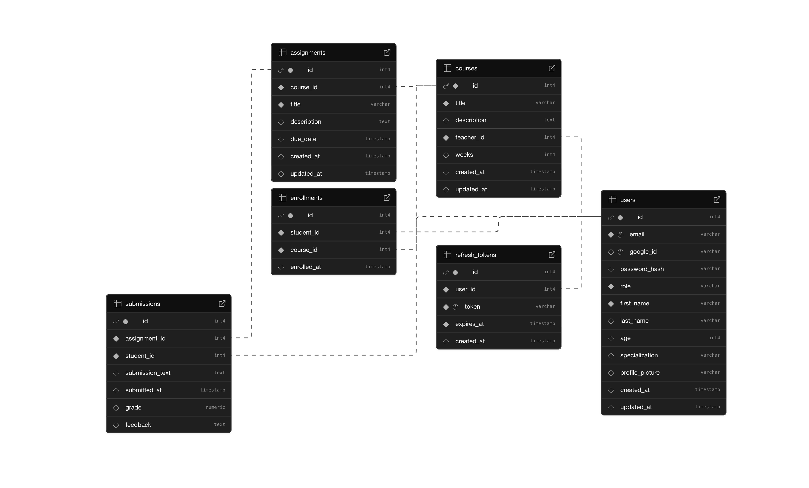

<div align="center">

# 🎓 AcademiaSync

### Smart Learning Management System with OAuth & Role-Based Access Control

[](https://github.com/heyitsgautham/AcademiaSync/actions)
[](https://www.docker.com/)
[](https://nextjs.org/)
[](https://www.typescriptlang.org/)
[](https://nodejs.org/)
[](https://www.postgresql.org/)
[](LICENSE)

**A modern, scalable learning platform built with microservices architecture, featuring Google OAuth authentication, real-time analytics, and comprehensive course management.**


</div>

---

## � Quick Start

### Prerequisites

- **Docker Desktop** - [Download & Install](https://www.docker.com/products/docker-desktop)
- **Google OAuth Credentials** - [Setup Guide](#step-1-google-oauth-setup)
- **Git** - For cloning the repository

### Installation

#### Step 1: Google OAuth Setup

1. Go to [Google Cloud Console](https://console.cloud.google.com/)
2. Create a new project or select an existing one
3. Navigate to **APIs & Services** → **Credentials**
4. Click **Create Credentials** → **OAuth 2.0 Client ID**
5. Configure OAuth consent screen
6. Set application type to **Web application**
7. Add authorized redirect URI:
   ```
   http://localhost:3000/api/auth/callback/google
   ```
8. Copy your **Client ID** and **Client Secret**

#### Step 2: Clone & Configure

```bash
# Clone the repository
git clone https://github.com/heyitsgautham/AcademiaSync.git
cd AcademiaSync

# Copy environment files
cp .env.example .env
cp frontend/.env.example frontend/.env.local
cp backend/user-service/.env.example backend/user-service/.env
cp backend/course-service/.env.example backend/course-service/.env

# Edit frontend/.env.local and add your Google OAuth credentials:
NEXTAUTH_URL=http://localhost:3000
NEXTAUTH_SECRET=<generate-a-random-secret>
GOOGLE_CLIENT_ID=<your-google-client-id>
GOOGLE_CLIENT_SECRET=<your-google-client-secret>
NEXT_PUBLIC_BACKEND_URL=http://localhost:5000
INTERNAL_BACKEND_URL=http://user-service:5000
NEXT_PUBLIC_COURSE_SERVICE_URL=http://localhost:5001
INTERNAL_COURSE_SERVICE_URL=http://course-service:5001

# Backend services will use default configuration (no changes needed)
```

> 💡 **Generate NEXTAUTH_SECRET**: Run `openssl rand -base64 32` in terminal

#### Step 3: Launch with Docker

```bash
# Start all services
docker-compose up -d

# Check service health
docker-compose ps

# View logs
docker-compose logs -f
```

#### Step 4: Access the Application

- 🌐 **Frontend**: [http://localhost:3000](http://localhost:3000)
- 🔧 **User Service**: [http://localhost:5000/health](http://localhost:5000/health)
- 🔧 **Course Service**: [http://localhost:5001/health](http://localhost:5001/health)

#### Step 5: Create Admin Account

After first login with Google:

```bash
# Access the database
docker exec -it academiasync-db psql -U postgres -d academiasync

# Promote your user to admin (replace with your email)
UPDATE users SET role = 'Admin' WHERE email = 'your-email@gmail.com';
\q
```

### Stopping the Application

```bash
# Stop all services
docker-compose down

# Stop and remove volumes (reset database)
docker-compose down -v
```

---


## 🗂️ Project Structure

```
AcademiaSync/
├── 📁 backend/
│   ├── 📁 user-service/              # Authentication & User Management
│   │   ├── 📁 src/
│   │   │   ├── index.js              # Express server entry point
│   │   │   ├── 📁 config/
│   │   │   │   └── database.js       # PostgreSQL connection pool
│   │   │   ├── 📁 middleware/
│   │   │   │   ├── auth.js           # JWT authentication middleware
│   │   │   │   └── authorize.js      # Role-based authorization
│   │   │   ├── 📁 routes/
│   │   │   │   ├── auth.js           # OAuth & JWT endpoints
│   │   │   │   ├── admin.js          # Admin-only routes
│   │   │   │   └── profile.js        # User profile management
│   │   │   └── 📁 utils/
│   │   │       ├── hateoas.js        # HATEOAS link generation
│   │   │       └── logger.js         # Morgan logger configuration
│   │   ├── 📁 tests/                 # Jest test suites
│   │   ├── 📁 logs/                  # Access logs (auto-generated)
│   │   ├── Dockerfile                # Service containerization
│   │   ├── package.json              # Dependencies
│   │   └── .env.example              # Environment template
│   │
│   ├── 📁 course-service/            # Courses, Assignments & Enrollments
│   │   ├── 📁 src/
│   │   │   ├── index.js              # Express server entry point
│   │   │   ├── 📁 config/
│   │   │   │   └── database.js       # PostgreSQL connection pool
│   │   │   ├── 📁 middleware/
│   │   │   │   └── auth.js           # JWT verification
│   │   │   ├── 📁 routes/
│   │   │   │   ├── student.js        # Student-specific routes
│   │   │   │   ├── teacher.js        # Teacher-specific routes
│   │   │   │   └── courses.js        # Course CRUD operations
│   │   │   └── 📁 utils/
│   │   │       └── hateoas.js        # HATEOAS link generation
│   │   ├── 📁 tests/                 # Jest test suites
│   │   ├── 📁 logs/                  # Access logs (auto-generated)
│   │   ├── Dockerfile                # Service containerization
│   │   ├── package.json              # Dependencies
│   │   └── .env.example              # Environment template
│   │
│   └── 📁 database/
│       └── init.sql                  # Database schema initialization
│
├── 📁 frontend/                      # Next.js Application
│   ├── 📁 app/                       # Next.js App Router
│   │   ├── layout.tsx                # Root layout with providers
│   │   ├── page.tsx                  # Landing page
│   │   ├── 📁 api/                   # API route handlers
│   │   │   ├── 📁 auth/
│   │   │   │   └── [...nextauth]/    # NextAuth configuration
│   │   │   ├── 📁 student/           # Student API routes
│   │   │   ├── 📁 teacher/           # Teacher API routes
│   │   │   └── 📁 admin/             # Admin API routes
│   │   ├── 📁 student/               # Student pages
│   │   │   ├── dashboard/
│   │   │   ├── courses/
│   │   │   ├── assignments/
│   │   │   ├── analytics/
│   │   │   └── settings/
│   │   ├── 📁 teacher/               # Teacher pages
│   │   │   ├── dashboard/
│   │   │   ├── courses/
│   │   │   ├── assignments/
│   │   │   ├── students/
│   │   │   ├── analytics/
│   │   │   └── settings/
│   │   └── 📁 admin/                 # Admin pages
│   │       ├── dashboard/
│   │       ├── teachers/
│   │       ├── students/
│   │       ├── courses/
│   │       ├── analytics/
│   │       └── settings/
│   ├── 📁 components/                # React components
│   │   ├── ui/                       # shadcn/ui base components
│   │   ├── student-*.tsx             # Student-specific components
│   │   ├── teacher-*.tsx             # Teacher-specific components
│   │   └── admin-*.tsx               # Admin-specific components
│   ├── 📁 lib/
│   │   ├── api-client.ts             # API client with auth
│   │   └── utils.ts                  # Utility functions
│   ├── 📁 types/
│   │   └── index.ts                  # TypeScript type definitions
│   ├── middleware.ts                 # Next.js middleware for auth
│   ├── Dockerfile                    # Frontend containerization
│   ├── package.json                  # Dependencies
│   └── .env.example                  # Environment template
│
├── 📁 deployment/                    # Deployment scripts
│   ├── deploy.sh                     # Cloud deployment script
│   ├── init-db.sh                    # Database initialization
│   └── setup-supabase.sql            # Supabase setup
│
├── docker-compose.yml                # Multi-service orchestration
├── .env.example                      # Root environment template
├── .gitignore                        # Git ignore rules
└── README.md                         # This file!
```

### Key Files Description

| File | Purpose |
|------|---------|
| `docker-compose.yml` | Defines all services, networks, and volumes |
| `backend/database/init.sql` | PostgreSQL schema with tables and relationships |
| `frontend/app/api/auth/[...nextauth]/route.ts` | OAuth configuration and JWT handling |
| `frontend/middleware.ts` | Route protection and role-based redirects |
| `backend/*/src/middleware/auth.js` | JWT validation middleware |
| `backend/*/src/utils/hateoas.js` | Self-documenting API links |

---


## 🗄️ Database Schema

### Entity Relationship Diagram



---

## 🔧 Environment Configuration

Copy `.env.example` to `.env` and adjust as needed:

```bash
cp .env.example .env
```

Default configuration:
- PostgreSQL User: `postgres`
- PostgreSQL Password: `postgres`
- Database Name: `academiasync`


---

## 🛠️ Tech Stack

<div align="center">

### Frontend

| Technology | Purpose | Version |
|------------|---------|---------|
|  | React Framework (App Router) | 14.x |
|  | Type Safety | 5.0.x |
|  | UI Library | 18.x |
|  | Styling | 3.4.x |
|  | UI Components | Latest |
|  | State Management | 5.64.x |
|  | Authentication | 4.x |
|  | Data Visualization | 2.x |
|  | Form Management | 7.x |
|  | Schema Validation | 1.x |
|  | Theme Management | 0.3.x |

### Backend

| Technology | Purpose | Version |
|------------|---------|---------|
|  | Runtime Environment | 20.x |
|  | Web Framework | 4.x |
|  | Database | 16.x |
|  | Token Authentication | 9.x |
|  | OAuth 2.0 | 9.x |
|  | HTTP Logging | 1.10.x |
|  | Password Hashing | 2.4.x |
|  | Cross-Origin Resource Sharing | 2.8.x |
|  | Cookie Parsing | 1.4.x |

### DevOps & Infrastructure

| Technology | Purpose | Version |
|------------|---------|---------|
|  | Containerization | 24.x |
|  | Orchestration | 2.x |
|  | CI/CD Pipeline | Latest |
|  | Testing Framework | 29.x |
|  | API Testing | 6.x |

</div>

---


### 🎓 Built with ❤️ for Education

**AcademiaSync** - Empowering Teachers, Inspiring Students

[⬆ Back to Top](#-academiasync)

---

Made with ☕ and 💻 | © 2025 AcademiaSync | [MIT License](LICENSE)

</div>
